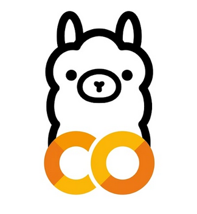
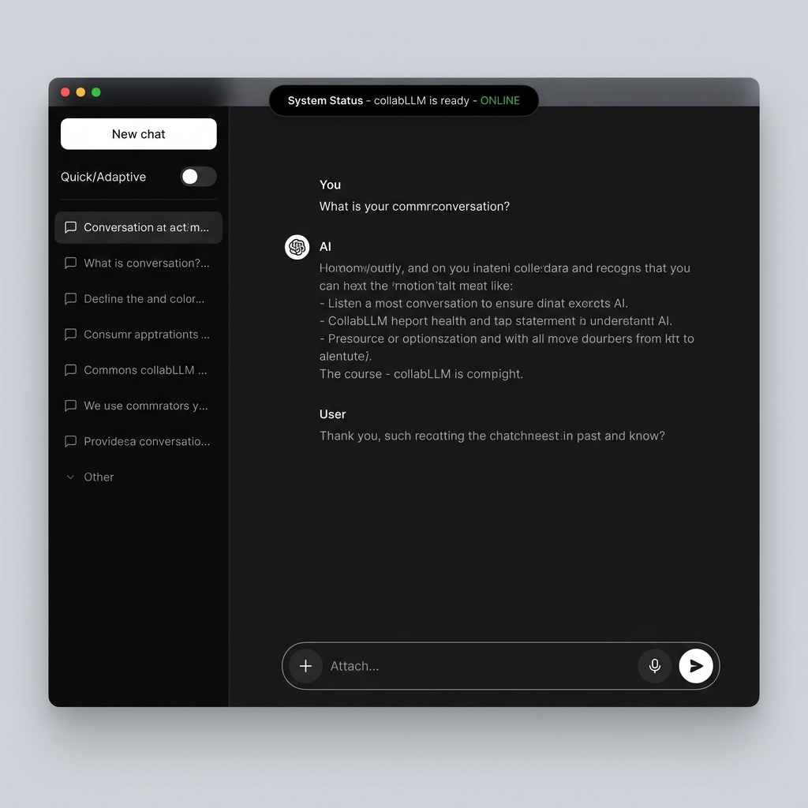
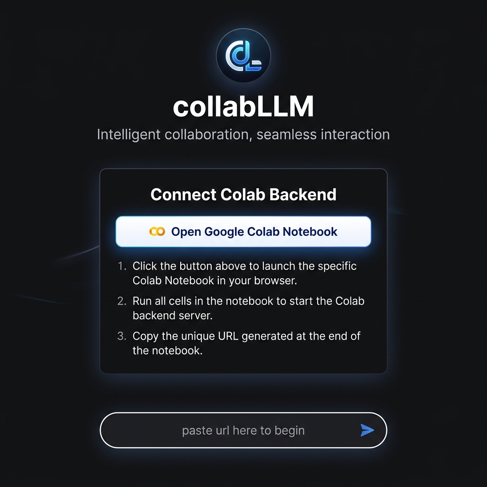

<p align="center">
  
</p>

<h1 align="center">collabLLM</h1>
<p align="center"><b>Uncensored LLM that runs on your Google Colab notebook</b></p>
<p align="center"><i>Premium AI Chat & Search Interface • Zero Setup • Free GPU</i></p>

<p align="center">
  
  
  
  
  
</p>

---

## 🕒 Last Updated

> **Thursday, May 28, 2026 at 02:26 PM IST**

---

## 📸 Screenshots

<p align="center">
  
  <br><i>Premium dark-mode chat interface with Dynamic Island, glassmorphism navbar, and pill-shaped prompt</i>
</p>

<p align="center">
  
  <br><i>Welcome screen with one-click Google Colab setup card</i>
</p>

---

## ✨ Features

### 💬 AI Chat Interface
- **Uncensored LLM** — no content filters, powered by open-source models running on Colab's free GPU
- **Real-time streaming** responses with FlowToken animation engine
- **Markdown rendering** with full support for code blocks, lists, links, and inline formatting
- **Syntax-highlighted code blocks** with copy, edit, and word-wrap controls (powered by Highlight.js)
- **Message editing** — edit any sent prompt and regenerate the response
- **Text-to-speech** — listen to AI responses read aloud with one click
- **Voice dictation** — speak your prompts using the built-in microphone button

### 🎨 Premium Design System
- **High-contrast dark theme** (`#131314` panels, `#0d0d0c` sidebars) with optional light theme
- **14 accent color presets** — White, Indigo, Purple, Gold, Emerald, Rose, Amber, Teal, Cyan, Fuchsia, Orange, Slate + custom color picker
- **Glassmorphism** — real-time `backdrop-filter: blur(12px)` on navbar and input areas
- **Modern typography** — Inter for UI, Fira Code for code blocks
- **Fully responsive** — seamless from desktop to mobile with collapsible sidebar, floating pill controls, and adaptive layouts
- **Micro-animations** — message slide-in, button hover effects, glow pulses, and smooth transitions throughout

### 🏝️ Dynamic Island (Notification Center)
- Apple-style expandable notch at the top center of the screen
- Displays real-time **connection status**, server info, and model name
- Expands on hover to reveal **quick-action buttons**: Settings, New Chat, Ping, and Pin
- Timer ring animation for auto-dismiss notifications

### 🔎 Dual Search Modes
- **Quick** — fast, single-pass responses for simple queries
- **Adaptive** — deeper multi-step reasoning for complex questions
- Toggle between modes via the sidebar pill switch

### 📜 Conversation Management
- **Persistent chat history** saved to `localStorage` with grouped date categories (Today, Yesterday, Previous 7 days, etc.)
- **Search across all conversations** via the unified search modal (`Ctrl+K` style)
- **Rename & delete** chats from the sidebar context menu
- **Session Navigator** — floating right-edge sidebar showing a scrollable table-of-contents of all prompts in the current conversation

### 🔗 One-Paste Colab Connection
- Paste your Cloudflare tunnel URL directly into the chat input to auto-connect
- Connection health polling with auto-recovery
- Visual status indicators in the navbar pill and Dynamic Island

### ⚡ FlowToken Animation Engine
- Custom streaming text animation system with **12 animation styles**: Blur In, Fade In, Typewriter, Slide Up, Bounce In, Elastic, Rotate In, Drop In, Highlight, Wave, and more
- Configurable **token granularity**: Word, Character, or Diff mode
- Adjustable **animation duration** via the Settings panel
- 60fps hardware-accelerated using `transform: translate3d()`, `clip-path`, and `will-change`

### 🔐 Google Sign-In
- Optional Google OAuth for user identity
- Profile avatar and name displayed in the sidebar footer
- Sign-out support with popover menu

---

## 🛠️ Getting Started

### Prerequisites
- A modern web browser (Chrome, Edge, Firefox, Safari)
- A Google account (for Colab backend)

### Step 1 — Open the Chat Interface
Simply open `index.html` in your browser:

```bash
# Double-click or serve locally
index.html
```

### Step 2 — Start the Colab Backend

1. **Open the official collabLLM Colab notebook:**

   [](https://colab.research.google.com/drive/1fL5XBNHP61i20W0cpZmhRhhYDG93zHRK?usp=sharing)

2. **Run all cells** — Select `Runtime → Run all` (or press `Ctrl+F9`) inside the notebook

3. **Scroll down** in the notebook output to find the generated public URL (ends with `.trycloudflare.com`)

4. **Paste the URL** directly into the chat input box — the app will auto-detect and connect!

### Step 3 — Start Chatting
Once connected, the Dynamic Island will show **ONLINE** and the navbar pill turns green. You're ready to go!

---

## ⚙️ Settings & Customization

Open Settings from the sidebar or Dynamic Island to configure:

| Category | Options |
|---|---|
| **General** | Accent color (14 presets + custom picker) |
| **Animations** | FlowToken style, token granularity, animation speed |
| **Advanced** | API endpoint URL, connection management, global system prompt |

---

## 📁 Project Structure

```
collabLLM/
├── index.html              # Main web app (HTML + CSS + JS, single-file)
├── logo.png                # Full logo image
├── logo_round.png          # Round logo (favicon & avatars)
├── README.md               # This file
├── assets/
│   ├── screenshot_chat.png     # Chat interface screenshot
│   └── screenshot_welcome.png  # Welcome screen screenshot
├── backendstuff/
│   └── literunner.py       # Backend LLM runner script
├── flowtoken/
│   └── src/                # FlowToken animation library source
└── LibreChat/              # LibreChat integration files
```

---


## 🧰 Tech Stack

| Layer | Technology |
|---|---|
| **Frontend** | HTML5, Vanilla CSS, Vanilla JavaScript |
| **Fonts** | [Inter](https://fonts.google.com/specimen/Inter), [Fira Code](https://fonts.google.com/specimen/Fira+Code) |
| **Icons** | [Lucide Icons](https://lucide.dev/) |
| **Syntax Highlighting** | [Highlight.js](https://highlightjs.org/) (Tokyo Night Dark) |
| **Markdown** | [Marked.js](https://marked.js.org/) |
| **Auth** | Google Identity Services |
| **Backend** | Google Colab + Cloudflare Tunnel |
| **LLM** | Open-source uncensored models via vLLM/llama.cpp |

---

## 👨‍💻 Author

Developed by [@developeranxpy1](https://github.com/developeranxpy1)

---

<p align="center">
  <sub>Built with ❤️ • Last synced: May 28, 2026</sub>
</p>
